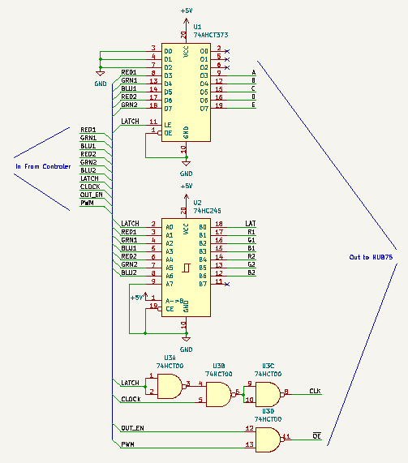

# hub75-framebuffer

[](https://crates.io/crates/hub75-framebuffer)
[](https://docs.rs/hub75-framebuffer)
[](README.md)
[](https://coveralls.io/github/liebman/hub75-framebuffer?branch=main)

DMA-friendly framebuffer implementations for driving HUB75 RGB LED matrix panels with Rust.  The crate focuses on **performance**, **correct timing**, and **ergonomic drawing** by integrating tightly with the `embedded-graphics` ecosystem.

---

## How HUB75 LED panels work (very short recap)

A HUB75 panel behaves like a long daisy-chained shift-register:

1. Color data for *one pair of rows* is shifted in serially on every cycle of `CLK`.
2. After the last pixel of the row pair has been clocked, the controller blanks the LEDs (`OE` HIGH), sets the address lines **A–E**, and produces a short pulse on `LAT` to latch the freshly-shifted data into the LED drivers.
3. `OE` goes LOW again and the row pair lights up while the next one is already being shifted.

Color depth is achieved with **Binary/Bit-Angle Code Modulation (BCM)**: lower bit-planes are shown for shorter times, higher ones for longer, yielding 2^n intensity levels per channel while keeping peak currents low.

If you want a deeper explanation, have a look inside `src/lib.rs` — the crate documentation contains an extensive primer.

---

## Two framebuffer flavors

| Module              | Extra hardware | Word size | Memory use | Pros / Cons |
|---------------------|----------------|-----------|------------|-------------|
| `plain`             | none           | 16 bit    | high       | Simplest, wires exactly like a standard HUB75 matrix. |
| `latched`           | **external latch gate** (see below) | 8 bit | ×½ of `plain` | Lower memory footprint, but needs a tiny glue-logic board. |

### The latch circuit

The *latched* implementation assumes a small external circuit that
holds the row address while gating the pixel clock.  A typical solution uses a 74xx373 latch along with a few NAND gates:



The latch IC stores the address bits whilst one NAND gate blocks the `CLK` signal during the latch interval.  The remaining spare gate can be employed to combine a global PWM signal with `OE` for fine-grained brightness control as shown.

---

## Getting started

Add the dependency to your `Cargo.toml`:

```toml
[dependencies]
hub75-framebuffer = "0.1.0"
embedded-graphics = "0.8"
```

### Choose your parameters

```rust
use hub75_framebuffer::{compute_frame_count, compute_rows};
use hub75_framebuffer::latched::DmaFrameBuffer; // or ::plain::DmaFrameBuffer

const ROWS:       usize = 32;              // panel height
const COLS:       usize = 64;              // panel width
const BITS:       u8    = 3;               // colour depth ⇒ 7 BCM frames
const NROWS:      usize = compute_rows(ROWS);          // 16
const FRAME_COUNT:usize = compute_frame_count(BITS);   // (1<<BITS)-1 = 7

// Create a framebuffer (already initialized/cleared)
let mut framebuffer = DmaFrameBuffer::<ROWS, COLS, NROWS, BITS, FRAME_COUNT>::new();

// Draw a red rectangle
Rectangle::new(Point::new(10, 10), Size::new(20, 20))
    .into_styled(PrimitiveStyle::with_fill(Color::RED))
    .draw(&mut framebuffer)
    .unwrap();
```

You can now draw using any `embedded-graphics` primitive:

```rust
use embedded_graphics::prelude::*;
use embedded_graphics::primitives::{Circle, Rectangle, PrimitiveStyle};
use hub75_framebuffer::Color;

Rectangle::new(Point::new(0, 0), Size::new(COLS as u32, ROWS as u32))
    .into_styled(PrimitiveStyle::with_fill(Color::BLACK))
    .draw(&mut framebuffer)
    .unwrap();

Circle::new(Point::new(20, 10), 8)
    .into_styled(PrimitiveStyle::with_fill(Color::GREEN))
    .draw(&mut framebuffer)
    .unwrap();
```

Finally hand the raw DMA buffer off to your MCU's parallel peripheral.

---

## Crate features

* `doc-images` – embed documentation images when building docs.
* `esp-dma`    – enable if your using `esp-hal`.
* `esp32`      – adjust byte ordering required by the ESP32 quirky I²S peripheral.

Enable them in your `Cargo.toml` or with `--features`.

---

## Running tests

```shell
cargo test
```

All logic including bitfields, address mapping, brightness modulation and the `embedded-graphics` integration is covered by a comprehensive test-suite (≈ 300 tests).

---

## License

Licensed under either of

* Apache License, Version 2.0, ([LICENSE-APACHE](LICENSE-APACHE) or <http://www.apache.org/licenses/LICENSE-2.0>)
* MIT license ([LICENSE-MIT](LICENSE-MIT) or <http://opensource.org/licenses/MIT>)

at your option.
